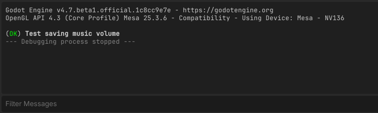
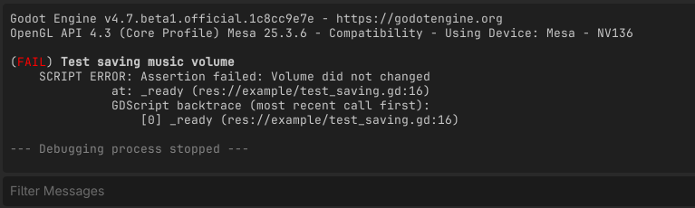
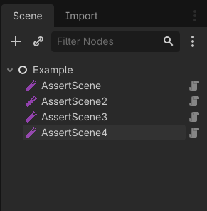

# AssertTest
AssertTest was created so we could test scenes using [Godot](https://godotengine.org/) built-in [`assert`](https://docs.godotengine.org/en/stable/classes/class_@gdscript.html#class-gdscript-method-assert).

It's just ~120 lines of code that check if a scene produced any stderr (because asserts generate stderr when failing).  

## Installing
Copy the `addons` directory to your project directory.  

## Usage
Create a scene that does whatever you want to test.  

For example, let's create a test for changing music volume:  

  

We add a script that use `assert` for testing:  

```gdscript
extends MarginContainer


func _ready() -> void:
	# Preparing to quit after this function finish.
	get_tree().quit.call_deferred(0)
	
	var initial_volume: int = $SettingsPopup.get_music_volume()
	var desired_volume: int = 50

	assert(initial_volume != desired_volume, "Volumes should be different for this test")

	$SettingsPopup.set_music_volume(desired_volume)
	var new_volume: int = $SettingsPopup.get_music_volume()

	assert(new_volume != desired_volume, "Volume did not changed")
```

Now we create another scene, which we will use to test as many scenes we are interessing.  

  

`AssertScene` is responsible for executing another scene, so we need to set the property `scene` to the scene that we want to test.  

  

That's it! Execute this scene to test the previous scene.  

  

When failing it will show you the captured stderr:  

  

As you create more test scene, you just have to add more `AssertScene` to this scene and execute it.  

  
