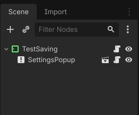
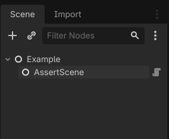
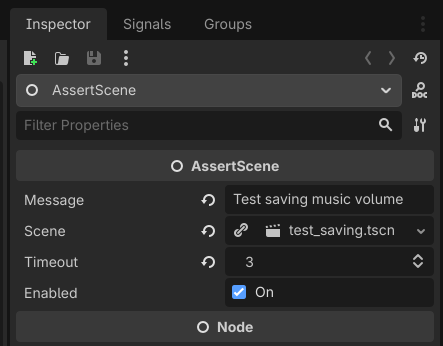

# AssertTest
AssertTest was created so we could test scenes using [Godot](https://godotengine.org/) built-in [assert()](https://docs.godotengine.org/en/stable/classes/class_@gdscript.html#class-gdscript-method-assert).  
It's just ~120 lines of code that check if a scene produced any stderr (asserts generate stderr when failing).  

## Installing

## Usage
Create a scene that does whatever you want to test. For example, let's create a test for changing music volume:  

  

```gdscript
extends MarginContainer


func _ready() -> void:
	# Preparing quit after this function finish.
	get_tree().quit.call_deferred(0)
	
	$SettingsPopup.set_music_volume(50)
	assert($SettingsPopup.get_music_volume() == 50)
```

Now create another scene, which we will use to test as many scenes we are interessing. 
This scene will have `AssertScene` as child:  

  

This node is responsible for executing a scene, so update the `scene` property with the scene
that you want to test.  

  

That's it, execute this scene to test the previous scene.  

As you create more test scene, you just have to add them to this scene and execute it.  
